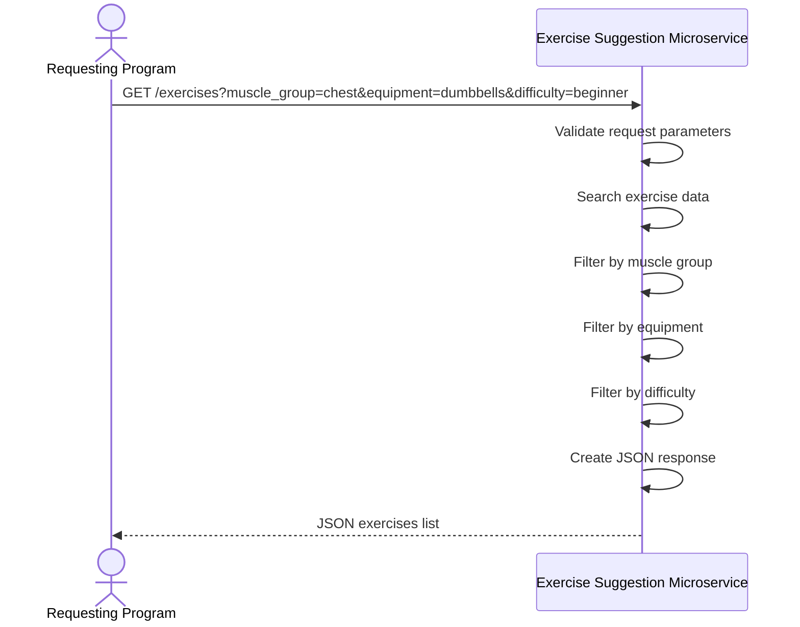

# Exercise Suggestion Microservice

CS361 Small Pool microservice that returns exercise recommendations over a REST JSON API.

## What this service does

Given optional workout preferences, the service returns matching exercises from a built-in list. You can filter by muscle group, equipment, and difficulty.

## Assigned teammates

- Derrick McClain
- Saugat
- Yelyzaveta

## Endpoint

| Method | Endpoint | Purpose |
|--------|----------|---------|
| GET | `/exercises` | Get exercise suggestions |
| GET | `/health` | Health check |

### Request parameters (`GET /exercises`)

| Parameter | Required | Description |
|-----------|----------|-------------|
| `muscle_group` | No | One of: `chest`, `back`, `legs`, `arms`, `shoulders`, `core`, `full_body` |
| `equipment` | No | Example values: `dumbbells`, `bodyweight`, `barbell`, `kettlebell` |
| `difficulty` | No | Example values: `beginner`, `intermediate`, `advanced` |

If `muscle_group` is provided but not in the allowed list, the service returns HTTP **400** with an error message and the allowed values.

## How another program requests data

Send a **GET** request to `http://localhost:5001/exercises` with optional query parameters.

### Example request (Python)

```python
import requests

response = requests.get(
    "http://localhost:5001/exercises",
    params={
        "muscle_group": "chest",
        "equipment": "dumbbells",
        "difficulty": "beginner"
    }
)

print(response.json())
```

### Example request (curl)

```bash
curl "http://localhost:5001/exercises?muscle_group=chest&equipment=dumbbells&difficulty=beginner"
```

### Example success response

```json
{
  "filters": {
    "muscle_group": "chest",
    "equipment": "dumbbells",
    "difficulty": "beginner"
  },
  "count": 1,
  "exercises": [
    {
      "name": "Dumbbell Bench Press",
      "muscle_group": "chest",
      "equipment": "dumbbells",
      "difficulty": "beginner"
    }
  ]
}
```

### Example invalid muscle_group response

```bash
curl "http://localhost:5001/exercises?muscle_group=toes"
```

```json
{
  "error": "invalid muscle_group",
  "allowed": ["arms", "back", "chest", "core", "full_body", "legs", "shoulders"]
}
```

## How another program receives data

The response is JSON with three top-level keys:

| Key | Meaning |
|-----|---------|
| `filters` | The filters that were applied to the request |
| `count` | How many exercises matched |
| `exercises` | A list of matching exercises |

Each item in `exercises` has `name`, `muscle_group`, `equipment`, and `difficulty`.

### Example code for receiving the data

```python
exercise_data = response.json()

print("Number of exercises:", exercise_data["count"])
for exercise in exercise_data["exercises"]:
    print(exercise["name"])
```

## UML sequence diagram

How another program requests and receives exercise suggestions:



## How to run

1. Python 3.10+
2. From this folder:

```bash
pip install -r requirements.txt
python app.py
```

Service runs on `http://localhost:5001`.
